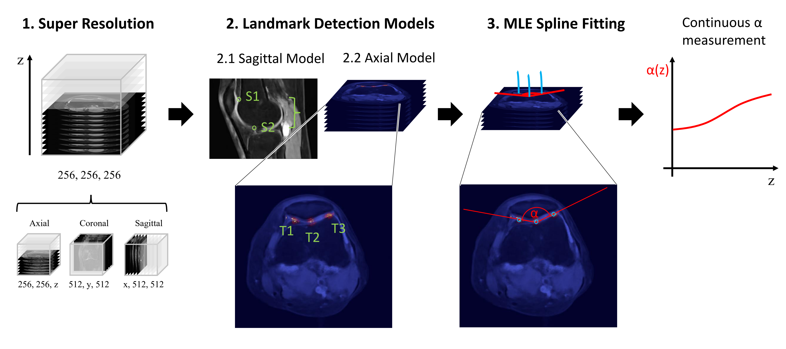
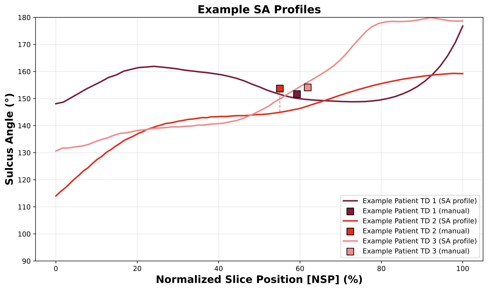
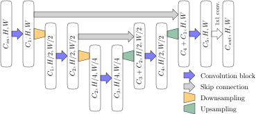

# SA-Profile: Automated Sulcus Angle Profiling from Super-Resolution MRI

[](https://arxiv.org/abs/2609.10125)
[](https://opensource.org/licenses/MIT)

Official PyTorch implementation of **"SA-Profile: Automated Sulcus Angle Profiling from Super-Resolution MRI"** ([arXiv:2609.10125](https://arxiv.org/abs/2609.10125)), presented at MICAD 2026.

---

## Overview

Trochlear dysplasia (TD) is a primary morphological abnormality of the femoral trochlea associated with anterior knee pain and patellar instability. Clinical sulcus angle (SA) assessment is conventionally performed on a single manually selected axial MR slice, making it sensitive to slice selection and landmark placement variability.

**SA-Profile** extends conventional SA assessment to an automated, continuous profile-based characterization across the entire trochlear region without requiring additional imaging:

<p align="center">
  
</p>
<p align="center">
  <em>Figure 1: Overview of the proposed pipeline. Clinically acquired multi-plane MR scans (axial, coronal, sagittal) are combined using implicit neural representations into a super-resolution volume. Sagittal landmarks ($S_1, S_2$) define the craniocaudal trochlear bounds, axial heatmaps localize trochlear landmarks ($T_1\text{--}T_3$), and 3D splines fitted through the predicted heatmap volume yield a continuous SA profile.</em>
</p>

### Key Components

1. **Super-Resolution Volume Reconstruction (`ssr/`)**: Combines clinically acquired multi-plane MR scans into isotropic high-resolution 3D volumes using Implicit Neural Representations (INRs) optimized via the Muon optimizer.
2. **Two-Stage Landmark Detection**:
   - **Stage 1 (Sagittal Bounds U-Net)**: Detects cranial ($S_1$) and caudal ($S_2$) trochlear boundaries to isolate the relevant anatomical region.
   - **Stage 2 (Axial Landmarks U-Net)**: Predicts three key landmarks (lateral condyle peak $T_1$, sulcus bottom $T_2$, medial condyle peak $T_3$) across axial slices.
3. **Continuous Profiling**: Fits 3D splines through the landmark heatmaps to yield smooth, continuous sulcus angle profiles across the femoral trochlea.

---

## Example SA Profiles

Continuous SA profiles capture rich morphological variations that single-slice measurements miss:

<p align="center">
  
</p>
<p align="center">
  <em>Figure 4: Example sulcus angle profiles from three in-house TD patients from the hold-out test set. Patient TD 1 demonstrates a relatively flat profile, Patient TD 2 shows a gradually increasing SA, and Patient TD 3 exhibits proximal trochlear flattening. The shaded box indicates the traditional manual single-slice measurement location.</em>
</p>

---

## Architecture

The landmark detection network is a 2D U-Net utilizing max-blur-pooling for anti-aliased downsampling, linear upsampling, and residual convolutional blocks with spatial cross-entropy loss over probabilistic heatmaps:

<p align="center">
  
</p>

---

## Repository Structure

```
SA_Profile/
├── ssr/                                # Implicit Neural Representation Super-Resolution
│   ├── network/                        # WIRE / MLP INR models and positional encoders
│   ├── postprocess/                    # Volume normalization and reconstruction
│   ├── main.py                         # SSR training entry point
│   ├── dataset.py                      # Multi-plane MRI slice dataset
│   ├── config.yaml                     # SSR training configuration
│   └── requirements_muon.txt           # Dependencies for SSR
├── models/                             # Landmark Detection Models
│   ├── UNet.py                         # 2D U-Net with max-blur-pooling & residual blocks
│   ├── loss.py                         # Spatial cross-entropy loss over heatmaps
│   └── utils.py                        # Keypoint coordinate extraction (argmax / weighted)
├── data/
│   ├── dataset_classes.py              # SagittalBoundsDataset & AxialLandmarkDataset
│   ├── augmentation.py                 # Spatial and intensity data augmentations
│   └── lakefs.py                       # Data loading utilities
├── checkpoints/                        # Pretrained model weights
│   ├── axial_landmarks/best_model.pt   # Pretrained axial landmark U-Net
│   └── sagittal_bounds/best_model.pt   # Pretrained sagittal bounds U-Net
├── scripts/
│   ├── two_stage_inference.py          # End-to-end inference on a 3D NIfTI volume
│   ├── train_two_stage.py              # Two-stage U-Net training pipeline
│   ├── compute_sulcus_angles_spline.py # Continuous SA profile computation & spline fitting
│   ├── fit_3d_lines_from_heatmaps.py   # 3D landmark line fitting across volume
│   ├── compare_medical_evaluation.py   # Population analysis & comparison with manual reads
│   └── detailed_case_figure.py         # Visualizing individual SA profiles & overlays
├── assets/                             # Figures and architectural diagrams
│   ├── fig1_overview.png               # Method pipeline overview (Figure 1)
│   ├── fig4_sa_profiles.png            # Example patient SA profiles (Figure 4)
│   └── unet_architecture.svg           # U-Net landmark model architecture
├── config.yaml                         # Landmark detection pipeline configuration
└── knee_conda_env.yaml                 # Conda environment definition
```

---

## Installation

### 1. Landmark Detection Environment
Create and activate the conda environment:
```bash
conda env create -f knee_conda_env.yaml
conda activate knee
```

### 2. Super-Resolution (SSR) Dependencies
For training implicit neural representations with Muon:
```bash
cd ssr
pip install -r requirements_muon.txt
pip install git+https://github.com/KellerJordan/Muon
cd ..
```

---

## Quickstart & Inference

Pretrained checkpoints for both the sagittal bounds and axial landmark models are provided directly in `checkpoints/`.

### Running Automated SA Profiling on a 3D MRI Volume

Given a reconstructed 3D knee MRI volume in NIfTI format (`.nii` or `.nii.gz`):

```bash
python scripts/two_stage_inference.py \
    --config config.yaml \
    --sagittal_model checkpoints/sagittal_bounds/best_model.pt \
    --axial_model checkpoints/axial_landmarks/best_model.pt \
    --input_volume /path/to/volume.nii.gz \
    --output predictions.json
```

The output JSON will contain:
- `bounds`: Cranial and caudal slice limits (`z_min`, `z_max`)
- `landmarks`: Predicted coordinates for each slice in the trochlear region

### Continuous Sulcus Angle Profiling

Compute continuous sulcus angle curves from predicted landmark points:
```bash
python scripts/compute_sulcus_angles_spline.py \
    --predictions predictions.json \
    --output_plot sa_profile.png
```

---

## Super-Resolution MRI Reconstruction (`ssr/`)

To reconstruct an isotropic high-resolution 3D volume from orthogonal scans (axial, coronal, sagittal):

1. Specify scan paths in `ssr/config.yaml`:
   ```yaml
   data:
     ax_path: "path/to/axial.nii.gz"
     cor_path: "path/to/coronal.nii.gz"
     sag_path: "path/to/sagittal.nii.gz"
   ```
2. Run INR reconstruction:
   ```bash
   cd ssr
   python main.py --config config.yaml
   ```

---

## Training Landmark Detection Models

To train the two-stage landmark detection models from scratch:

```bash
# Stage 1: Sagittal bounds model
python scripts/train_two_stage.py --config config.yaml --model sagittal

# Stage 2: Axial landmark model
python scripts/train_two_stage.py --config config.yaml --model axial
```

---

## Citation

If you find this code or paper useful for your research, please cite:

```bibtex
@article{wehrli2026saprofile,
  title={SA-Profile: Automated Sulcus Angle Profiling from Super-Resolution MRI},
  author={Wehrli, Michael and Widmer, Leo and others},
  journal={arXiv preprint arXiv:2609.10125},
  year={2026}
}
```

---

## License

This project is licensed under the MIT License - see the [LICENSE](LICENSE) file for details.
